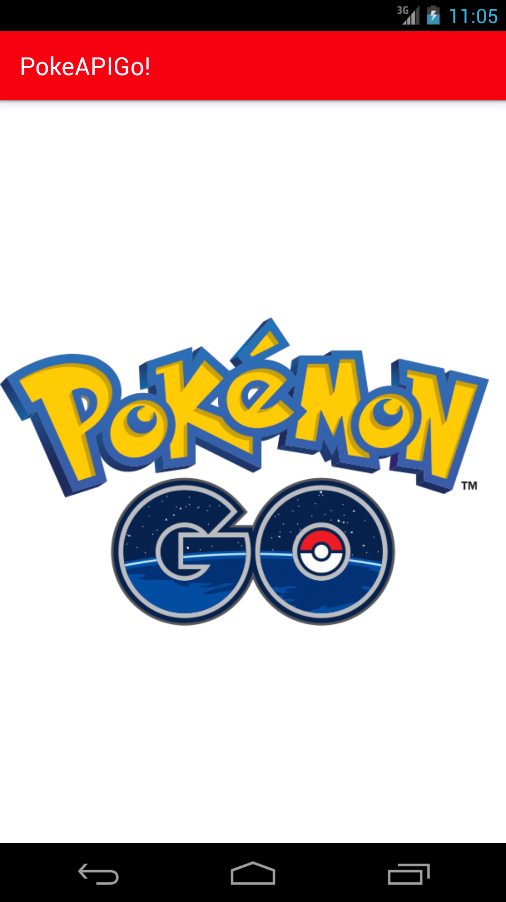
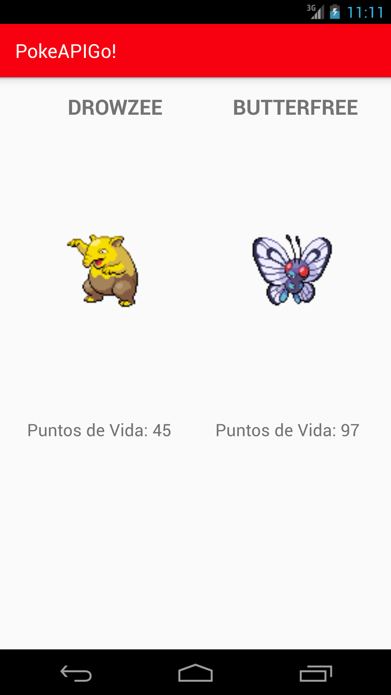
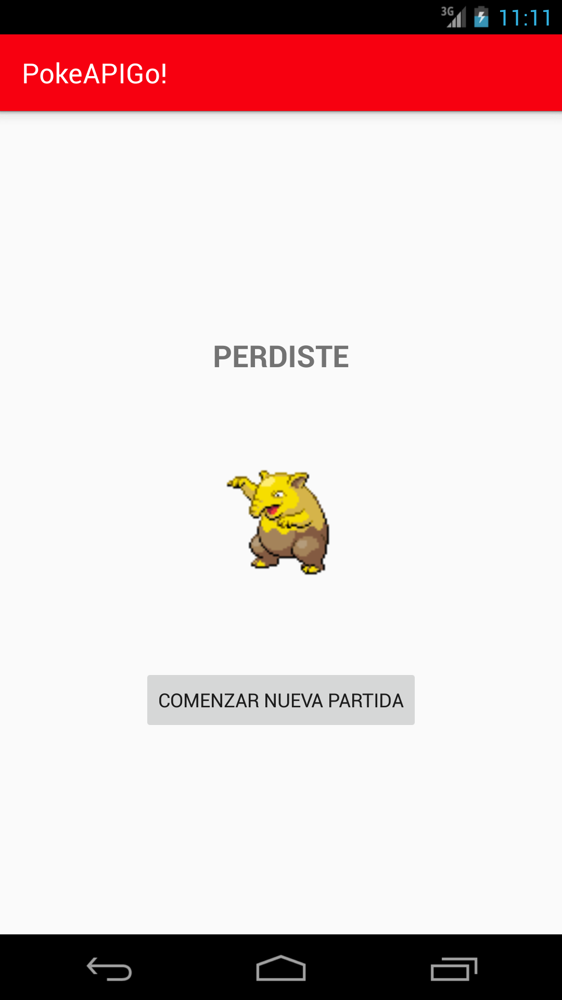
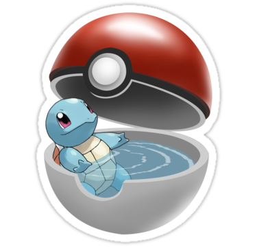

# PokeAPIGo!
Juego basado en la API de Pokémon

Link del diseño - versión live: https://share.proto.io/6MYH7J/

A continuación, se muestran pantallazos de la aplicación terminada: 

El logo de PokémonGo aparece por unos segundos al iniciar la aplicación. 

Así es como se ve una batalla. Los puntos de vida se reducen en un intervalo constante de tiempo y por turnos. 

En esta actividad se muestra el resultado de la batalla. 

Y este es el ícono de la app.
